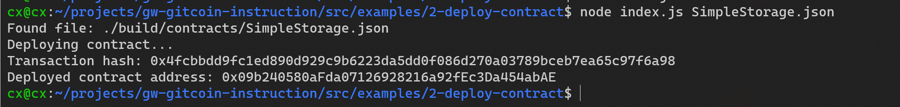

- 1. A screenshot of the console output immediately after you have successfully deployed a smart contract.

- 2. The transaction hash from the contract deployment (in text format).
0x4fcbbdd9fc1ed890d929c9b6223da5dd0f086d270a03789bceb7ea65c97f6a98
- 3. The deployed contract address from the contract deployment (in text format).
0x09b240580aFda07126928216a92fEc3Da454abAE