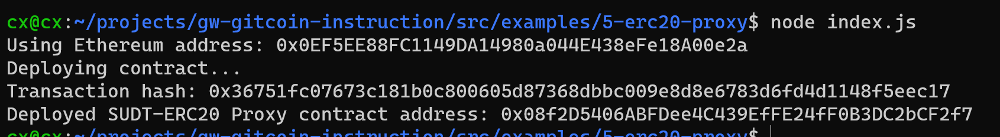
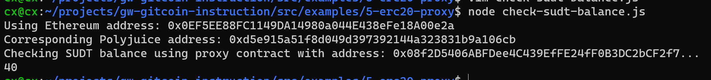

### A screenshot of the console output immediately after deploying smart contract.

### The address of the ERC20 Proxy Contract you deployed (in text format).

0x08f2D5406ABFDee4C439EfFE24fF0B3DC2bCF2f7

### A screenshot of the console output immediately after checking your SUDT balance.

### The Ethereum address that was checked (in text format).

0x0EF5EE88FC1149DA14980a044E438eFe18A00e2a