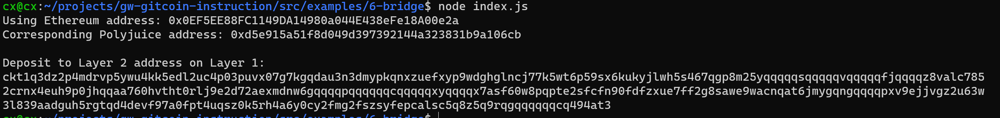

### 1. A screenshot of the console output immediately after you have successfully generated your Deposit Receiver Address.

### 2. Your Deposit Receiver Address (in text format).
The Ethereum address used to generate the Deposit Receiver Address (in text format).

0x0EF5EE88FC1149DA14980a044E438eFe18A00e2a

### 3. A link to the Etherscan explorer for the successful Force Bridge transaction. This can be found on Force Bridge under History→Succeed.

https://rinkeby.etherscan.io/tx/0x0f61f3c2db7c49261937587b3022b405ce71bb41c2cab41b032169d3b3b2d19e

### 4. A link to the Nervos explorer for the successful Force bridge transaction. This can be found on Force Bridge under History→Succeed.

https://explorer.nervos.org/aggron/transaction/0xf0dd13dfd4e75f61dad3027f73f0a6ca7bd30a6cc0d2ba6709407ed92ab08256

