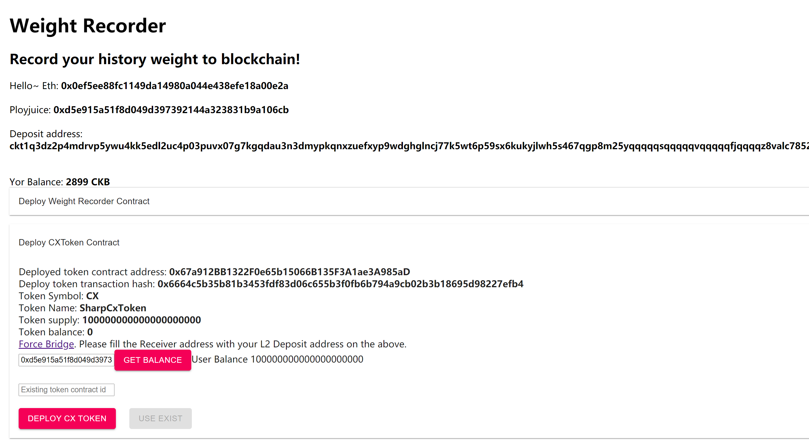
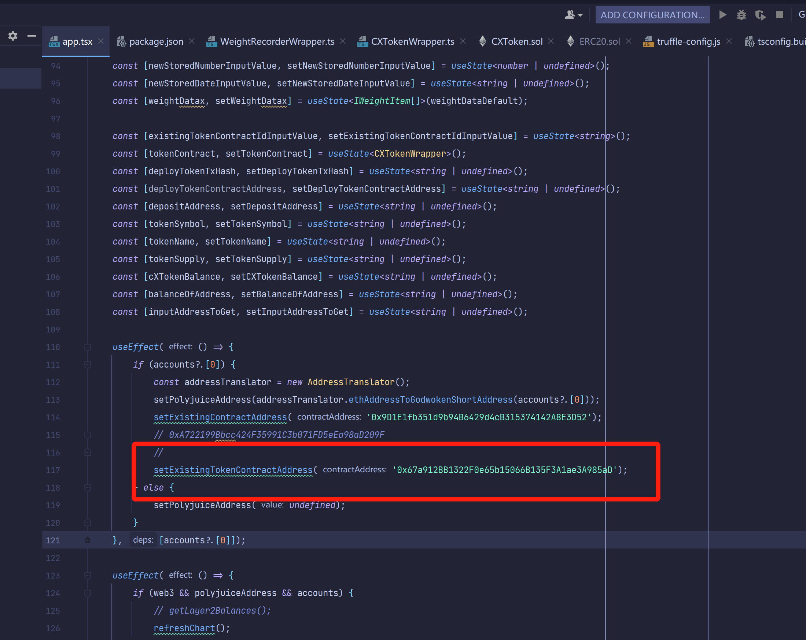

1. A screenshot or video of your EVM application on Layer 2 with Force Bridge support.

2. The address of the SUDT-ERC20 Proxy Contract that you deployed (in text format).

0x67a912BB1322F0e65b15066B135F3A1ae3A985aD

3. A link to the GitHub repository with your EVM application that integrates Force Bridge support.
https://github.com/SharpCX/CkbWeightRecorder/tree/task8

I had set a the cx token default contract address I had deployed before, also you can redeploy it and get a new address.

